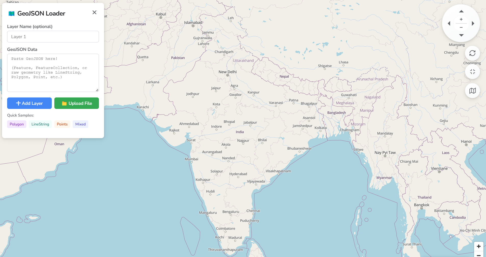
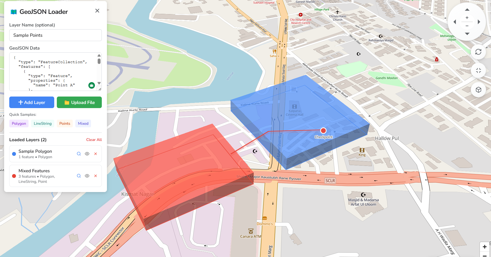

## GeoJSON Loader

**GeoJSON Loader** is a small web app that lets you quickly load and preview GeoJSON data (points, lines, and polygons) on an interactive map.

You can paste raw GeoJSON, or upload a `.json` / `.geojson` / `.txt` / `.docx` file, and see it styled on top of a base map. The app can show 3D extrusions for polygons, colored lines, and point markers with labels.

### Live demo

- **GeoJSON Loader (live)**: [https://geojson-loader.netlify.app](https://geojson-loader.netlify.app)

### Main features

- **Paste or upload GeoJSON**: Works with `Feature`, `FeatureCollection`, or raw geometry types (Point, LineString, Polygon, Multi\*).
- **Multiple layers**: Add many layers, each with its own color and name; toggle visibility, zoom to a layer, or remove it.
- **Smart camera**: Automatically flies to the bounds of your loaded data; reset view at any time.
- **2D / 3D view**: Switch between flat and tilted 3D map; polygons are shown as raised extrusions.
- **Map controls**: On‑screen pad for panning and zooming, plus fullscreen toggle.
- **Base maps**: Switch between a detailed OpenStreetMap style (via MapTiler) and a light CartoDB Positron style.

### Screenshots

Overall view of the app:



Example with loaded GeoJSON data:



### Tech stack

- **React 18** with **Vite**
- **MapLibre GL** via `react-map-gl/maplibre`

### Setup & running locally

1. **Install dependencies**
   ```bash
   npm install
   ```
2. **Configure MapTiler key (for the OpenStreetMap style)**
   - Create a `.env` file in the project root.
   - Add your MapTiler API key:
     ```bash
     VITE_MAPTILER_API_KEY=your_maptiler_key_here
     ```
   - Without this key, only the CartoDB Positron base map will work reliably.
3. **Start the dev server**
   ```bash
   npm run dev
   ```
4. Open the shown URL (usually `http://localhost:5173`) in your browser.

### How to use the app

1. Open the panel titled **“GeoJSON Loader”**.
2. (Optional) Enter a **Layer Name**.
3. Either:
   - Paste GeoJSON into the **GeoJSON Data** textarea, or
   - Click **“Upload File”** and choose a `.json` / `.geojson` file.
4. Click **“Add Layer”** to render it on the map.
5. Use the **Loaded Layers** list to:
   - Zoom to a layer,
   - Hide/show it, or
   - Remove it.
6. Use the round pad and buttons on the right side of the map to **pan, zoom, reset view, toggle fullscreen, and switch 2D/3D**.
